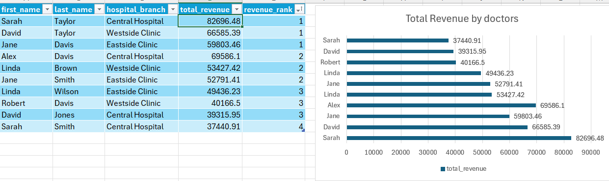
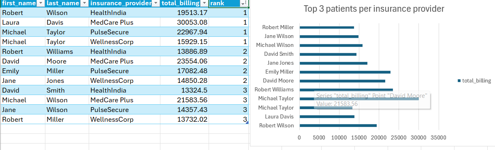
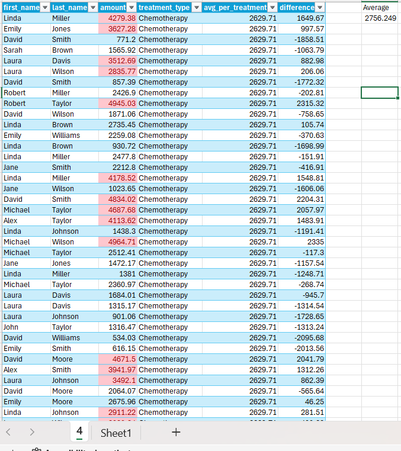
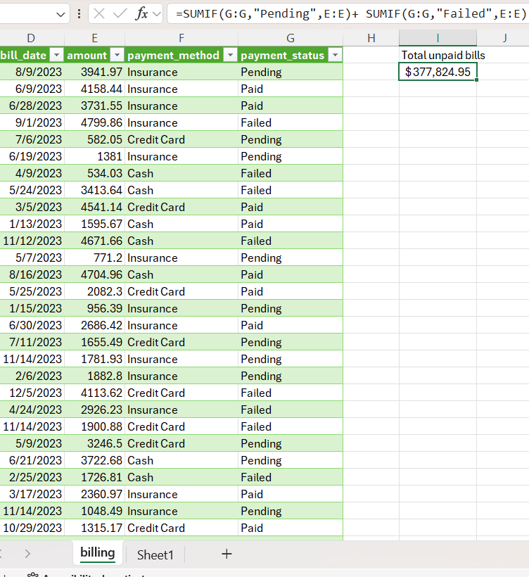
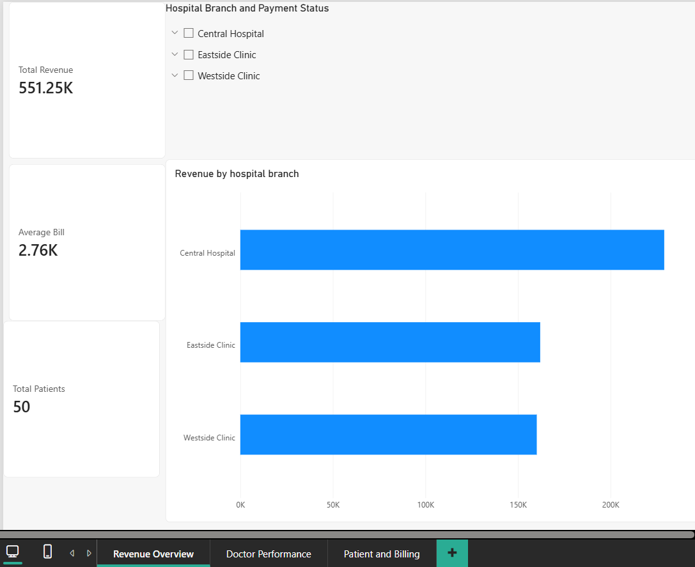
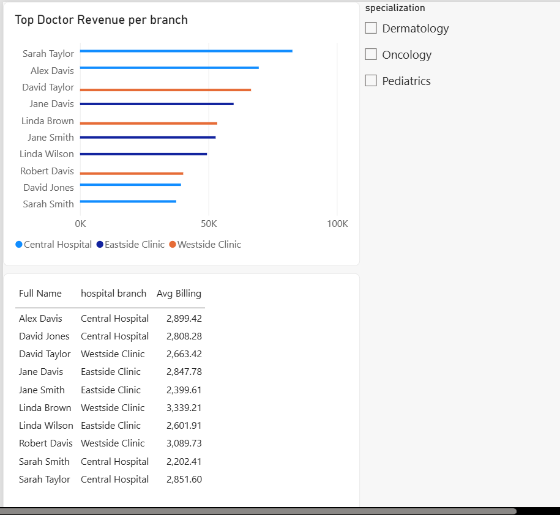
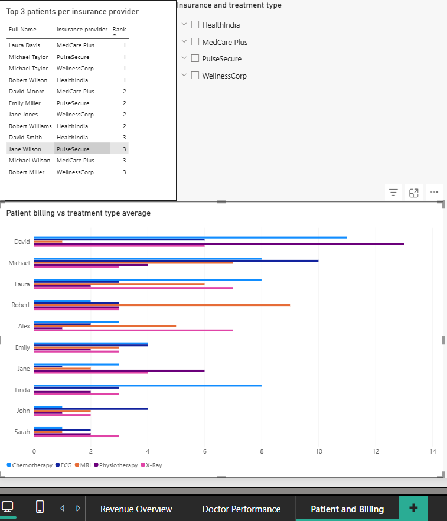

# 🏥 Hospital Management Analysis — Advanced SQL, Excel & Power BI Project

An advanced data analytics project analyzing a relational hospital management database across 5 tables — uncovering doctor performance, patient billing trends, appointment patterns, and treatment costs using multi-table JOINs, window functions, subqueries, and chained CTEs.

🔍 SQL Queries: [project_sql folder](/SQL/)
📊 Excel Analysis: [excel folder](/Excel/)
📈 Power BI Dashboard: [powerbi folder](/PowerBI/)

---

## 📌 Table of Contents
- [Background](#background)
- [Tools & Skills Used](#tools--skills-used)
- [Dataset](#dataset)
- [SQL Analysis](#sql-analysis)
- [Excel Analysis](#excel-analysis)
- [Power BI Dashboard](#power-bi-dashboard)
- [Key Findings](#key-findings)
- [What I Learned](#what-i-learned)

---

## Background

This project analyzes a relational hospital management database to answer key business questions about doctor revenue, patient billing, treatment costs, and insurance trends. Unlike previous projects that used a single flat CSV, this project works across 5 related tables — simulating a real-world database environment.

**Questions explored:**
1. Which doctors generate the most revenue and how do they rank within each hospital branch?
2. Which patients have billing amounts above the overall average?
3. Who are the top 3 most expensive patients per insurance provider?
4. How does each patient's billing compare to the average for their treatment type?
5. Which doctors treat more than one treatment type?
6. Who is the highest billing doctor per hospital branch?
7. Which patients were readmitted within 30 days?

---

## Tools & Skills Used

| Tool | Skills Applied |
|------|---------------|
| **PostgreSQL / pgAdmin** | Multi-table JOINs (4 tables), CTEs, chained CTEs, RANK(), ROW_NUMBER(), PARTITION BY, subqueries, AVG() as window function, COUNT DISTINCT, HAVING, Self JOIN, INTERVAL date calculations |
| **Excel** | Pivot Tables, bar charts, SUMIF, conditional formatting |
| **Power BI** | KPI cards, bar charts, tables, slicers, Power Query conditional columns |
| **VSCode** | Writing and organizing SQL files |
| **Git & GitHub** | Version control and project sharing |

---

## Dataset

**Source:** [Hospital Management Dataset — Kaggle](https://www.kaggle.com/datasets/kanakbaghel/hospital-management-dataset)

### Tables

| Table | Key Columns |
|-------|------------|
| **patients** | patient_id, first_name, last_name, gender, insurance_provider |
| **doctors** | doctor_id, first_name, last_name, specialization, hospital_branch, years_experience |
| **appointments** | appointment_id, patient_id, doctor_id, appointment_date, status |
| **treatments** | treatment_id, appointment_id, treatment_type, cost |
| **billing** | bill_id, patient_id, treatment_id, amount, payment_status |

---

## SQL Analysis

### 1. Doctor Revenue Ranking by Hospital Branch
**Skills: Multi-table JOIN (4 tables), CTE, SUM, RANK(), PARTITION BY**

Joined doctors → appointments → treatments → billing to calculate total revenue per doctor. Wrapped in a CTE then applied RANK() partitioned by hospital branch so each branch has its own ranking.

```sql
WITH doctor_revenue AS (
    SELECT
        first_name,
        last_name,
        hospital_branch,
        doctors.doctor_id,
        SUM(billing.amount) AS total_revenue
    FROM doctors
    INNER JOIN appointments ON doctors.doctor_id = appointments.doctor_id
    INNER JOIN treatments ON appointments.appointment_id = treatments.appointment_id
    INNER JOIN billing ON treatments.treatment_id = billing.treatment_id
    GROUP BY doctors.doctor_id, first_name, last_name, hospital_branch
    ORDER BY total_revenue DESC
)
SELECT
    first_name,
    last_name,
    hospital_branch,
    total_revenue,
    RANK() OVER (PARTITION BY hospital_branch ORDER BY total_revenue DESC) AS revenue_rank
FROM doctor_revenue
```

**Results:**

| Doctor | Hospital Branch | Total Revenue | Rank |
|--------|----------------|---------------|------|
| Sarah Taylor | Central Hospital | $82,696.48 | 1 |
| Alex Davis | Central Hospital | $69,586.10 | 2 |
| David Jones | Central Hospital | $39,315.95 | 3 |
| Sarah Smith | Central Hospital | $37,440.91 | 4 |
| Jane Davis | Eastside Clinic | $59,803.46 | 1 |
| Jane Smith | Eastside Clinic | $52,791.41 | 2 |
| Linda Wilson | Eastside Clinic | $49,436.23 | 3 |
| David Taylor | Westside Clinic | $66,585.39 | 1 |
| Linda Brown | Westside Clinic | $53,427.42 | 2 |
| Robert Davis | Westside Clinic | $40,166.50 | 3 |



---

### 2. Patients Whose Billing Exceeds the Overall Average
**Skills: Subquery, JOIN, SUM, GROUP BY**

Used a subquery inside the WHERE clause to dynamically calculate the overall average billing. The outer query returns only patients whose individual billing exceeds that average.

```sql
SELECT
    first_name,
    last_name,
    patients.patient_id,
    SUM(amount) AS total_billing
FROM billing
INNER JOIN patients ON patients.patient_id = billing.patient_id
WHERE amount > (
    SELECT AVG(amount) FROM billing
)
GROUP BY first_name, last_name, patients.patient_id
```

**Sample Results:**

| Patient | Total Billing |
|---------|--------------|
| David Moore | $20,415.28 |
| Robert Wilson | $16,776.83 |
| Emily Miller | $14,489.05 |
| Alex Moore | $11,267.43 |
| David Wilson | $10,606.99 |

---

### 3. Top 3 Most Expensive Patients Per Insurance Provider
**Skills: Chained CTEs, ROW_NUMBER(), PARTITION BY**

- CTE 1 (`patient_billing`): Calculates total billing per patient with insurance provider
- CTE 2 (`ranked_patients`): Assigns ROW_NUMBER() partitioned by insurance provider
- Final query filters to top 3 per provider

```sql
WITH patient_billing AS (
    SELECT
        billing.patient_id,
        first_name,
        last_name,
        insurance_provider,
        SUM(amount) AS total_billing
    FROM billing
    INNER JOIN patients ON patients.patient_id = billing.patient_id
    GROUP BY first_name, last_name, billing.patient_id, insurance_provider
),
ranked_patients AS (
    SELECT
        *,
        ROW_NUMBER() OVER (PARTITION BY insurance_provider ORDER BY total_billing DESC) AS row_num
    FROM patient_billing
)
SELECT * FROM ranked_patients WHERE row_num <= 3
```

**Results:**

| Patient | Insurance Provider | Total Billing | Rank |
|---------|-------------------|---------------|------|
| Robert Wilson | HealthIndia | $19,513.17 | 1 |
| Robert Williams | HealthIndia | $13,886.89 | 2 |
| David Smith | HealthIndia | $13,324.50 | 3 |
| Laura Davis | MedCare Plus | $30,053.08 | 1 |
| David Moore | MedCare Plus | $23,554.06 | 2 |
| Michael Wilson | MedCare Plus | $21,583.56 | 3 |
| Michael Taylor | PulseSecure | $22,967.94 | 1 |
| Emily Miller | PulseSecure | $17,082.48 | 2 |
| Jane Wilson | PulseSecure | $14,357.43 | 3 |
| Michael Taylor | WellnessCorp | $15,929.15 | 1 |
| Jane Jones | WellnessCorp | $14,850.28 | 2 |
| Robert Miller | WellnessCorp | $13,732.02 | 3 |



---

### 4. Patient Billing vs Treatment Type Average
**Skills: AVG() as window function, PARTITION BY, multi-table JOIN**

Used AVG() as a window function partitioned by treatment type — keeps each individual row while calculating the group average alongside it. The difference column shows how far above or below the treatment average each patient's bill is.

```sql
SELECT
    first_name,
    last_name,
    amount,
    treatment_type,
    ROUND(AVG(amount) OVER (PARTITION BY treatment_type), 2) AS avg_per_treatment,
    ROUND(amount - AVG(amount) OVER (PARTITION BY treatment_type), 2) AS difference
FROM billing
INNER JOIN treatments ON treatments.treatment_id = billing.treatment_id
INNER JOIN patients ON patients.patient_id = billing.patient_id
```

**Sample Results (Chemotherapy avg: $2,629.71):**

| Patient | Amount | Avg Per Treatment | Difference |
|---------|--------|------------------|------------|
| Robert Taylor | $4,945.03 | $2,629.71 | +$2,315.32 |
| David Smith | $4,834.02 | $2,629.71 | +$2,204.31 |
| Michael Taylor | $4,687.68 | $2,629.71 | +$2,057.97 |
| David Smith | $771.20 | $2,629.71 | -$1,858.51 |



---

### 5. Doctors Who Treat More Than One Treatment Type
**Skills: COUNT DISTINCT, HAVING, multi-table JOIN**

```sql
SELECT
    doctors.doctor_id,
    first_name,
    last_name,
    COUNT(DISTINCT treatment_type) AS num_treatments
FROM doctors
INNER JOIN appointments ON appointments.doctor_id = doctors.doctor_id
INNER JOIN treatments ON appointments.appointment_id = treatments.appointment_id
GROUP BY doctors.doctor_id, first_name, last_name
HAVING COUNT(DISTINCT treatment_type) > 1
```

**Results:** All 10 doctors treat all 5 treatment types (Chemotherapy, ECG, MRI, Physiotherapy, X-Ray).

| Doctor | Treatment Types |
|--------|----------------|
| David Taylor | 5 |
| Jane Davis | 5 |
| Jane Smith | 5 |
| David Jones | 5 |
| Sarah Taylor | 5 |
| Alex Davis | 5 |
| Robert Davis | 5 |
| Linda Brown | 5 |
| Sarah Smith | 5 |
| Linda Wilson | 5 |

---

### 6. Highest Billing Doctor Per Hospital Branch
**Skills: Chained CTEs, RANK(), PARTITION BY, AVG**

- CTE 1 (`avg_bill`): Calculates average billing per doctor per hospital branch
- CTE 2 (`rank_doctor`): Ranks doctors within each branch using RANK()
- Final query returns only rank 1 per branch

```sql
WITH avg_bill AS (
    SELECT
        hospital_branch,
        first_name,
        last_name,
        doctors.doctor_id,
        ROUND(AVG(amount), 2) AS avg_billing
    FROM doctors
    INNER JOIN appointments ON appointments.doctor_id = doctors.doctor_id
    INNER JOIN billing ON billing.patient_id = appointments.patient_id
    GROUP BY hospital_branch, first_name, last_name, doctors.doctor_id
),
rank_doctor AS (
    SELECT
        *,
        RANK() OVER (PARTITION BY hospital_branch ORDER BY avg_billing DESC) AS revenue_rank
    FROM avg_bill
)
SELECT * FROM rank_doctor WHERE revenue_rank = 1
```

**Results:**

| Hospital Branch | Doctor | Avg Billing | Rank |
|----------------|--------|-------------|------|
| Central Hospital | Alex Davis | $2,803.97 | 1 |
| Eastside Clinic | Jane Davis | $3,007.40 | 1 |
| Westside Clinic | Robert Davis | $3,041.66 | 1 |

---

### 7. Patients Readmitted Within 30 Days
**Skills: Self JOIN, date calculations, INTERVAL**

Joined the patients table to itself using two aliases (hc1, hc2) and appointments twice (a1, a2) to find patients with a second appointment within 30 days of their first.

```sql
SELECT
    hc1.first_name,
    hc1.last_name,
    a1.appointment_date AS first_appointment,
    a2.appointment_date AS second_appointment
FROM patients hc1
JOIN patients hc2 ON hc1.first_name = hc2.first_name
    AND hc1.last_name = hc2.last_name
JOIN appointments a1 ON a1.patient_id = hc1.patient_id
JOIN appointments a2 ON a2.patient_id = hc2.patient_id
WHERE a2.appointment_date > a1.appointment_date
AND a2.appointment_date <= a1.appointment_date + INTERVAL '30 days'
```

**Sample Results:**

| Patient | First Appointment | Second Appointment |
|---------|------------------|-------------------|
| Linda Miller | 2023-06-17 | 2023-06-19 |
| David Williams | 2023-04-01 | 2023-04-09 |
| Michael Taylor | 2023-04-26 | 2023-05-24 |
| David Wilson | 2023-01-12 | 2023-01-13 |
| John Brown | 2023-11-12 | 2023-11-14 |
| Laura Davis | 2023-10-22 | 2023-10-29 |

---

## Excel Analysis

### Pivot Table & Bar Chart — Total Revenue by Doctor and Hospital Branch

Sarah Taylor at Central Hospital led all doctors with $82,696.48 in total revenue.


---

### Bar Chart — Top 3 Patients Per Insurance Provider

Laura Davis (MedCare Plus) had the highest individual total billing at $30,053.08 across all insurance providers.


---

### SUMIF — Total Unpaid Bills

Combined Pending and Failed payments to calculate total unpaid billing:

```excel
=SUMIF(G:G,"Pending",E:E)+SUMIF(G:G,"Failed",E:E)
```

| Metric | Amount |
|--------|--------|
| **Total Unpaid Bills** | **$377,824.95** |



---

### Conditional Formatting — Billing Above Treatment Average

Highlighted patients whose billing exceeded the treatment type average. Overall average across all treatments: **$2,756.25**


---

## Power BI Dashboard

### Page 1 — Revenue Overview



| Metric | Value |
|--------|-------|
| Total Revenue | $551.25K |
| Average Bill | $2.76K |
| Total Patients | 50 |

- Central Hospital leads all branches in total revenue at over $200K
- Eastside and Westside Clinics are closely matched at ~$150K each

---

### Page 2 — Doctor Performance



- Sarah Taylor leads all doctors in total revenue at Central Hospital
- Chart color coded by hospital branch — Central Hospital (light blue), Eastside Clinic (dark blue), Westside Clinic (orange)
- Table shows full name, hospital branch, and average billing per doctor
- Slicer filters by specialization (Dermatology, Oncology, Pediatrics)

---

### Page 3 — Patient and Billing



- Top 3 patients per insurance provider shown in table with rank
- Patient billing vs treatment type average chart color coded by treatment type (Chemotherapy, ECG, MRI, Physiotherapy, X-Ray)
- Slicer filters by insurance provider and treatment type

---

## Key Findings

1. **Top Doctor:** Sarah Taylor at Central Hospital generated the highest total revenue at $82,696.48
2. **Highest Avg Billing Doctor Per Branch:** Robert Davis led Westside Clinic at $3,041.66 average per treatment
3. **Top Patient:** Laura Davis (MedCare Plus) had the highest individual total billing at $30,053.08
4. **Total Unpaid Bills:** $377,824.95 in pending and failed payments across all patients
5. **Most Readmitted Patient:** Michael Taylor had the most readmissions within 30-day windows
6. **Treatment Coverage:** All 10 doctors treat all 5 treatment types

---

## What I Learned

- **Multi-table JOINs:** Connected 4 tables in a single query to trace revenue from doctor all the way to billing
- **Window functions:** Used RANK(), ROW_NUMBER(), and AVG() as window functions — keeping row-level detail while showing group-level aggregations simultaneously
- **Chained CTEs:** Built two CTEs that reference each other to solve complex multi-step problems
- **Self JOIN:** Joined a table to itself using aliases to find patients with multiple appointments within 30 days
- **Subqueries:** Used a subquery inside WHERE to dynamically filter against a calculated average
- **Real relational database:** Worked across 5 separate tables with foreign key relationships — simulating a real-world hospital database
- **SUMIF in Excel:** Combined Pending and Failed payments to calculate total unpaid bills
- **Power BI slicers:** Built interactive dashboards that filter across multiple visuals simultaneously
